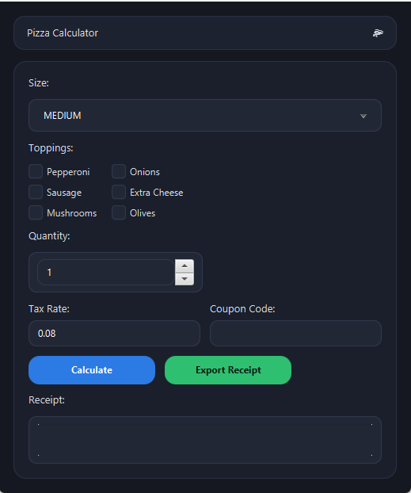
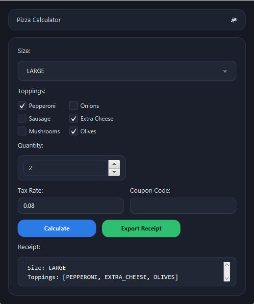

# JavaFX Pizza Ordering System


A modular JavaFX desktop application implementing object-oriented design principles, dynamic UI state management, and a test-validated real-time pricing engine.

This project demonstrates clean separation of UI rendering and business logic, reinforced with unit testing to ensure deterministic pricing behavior.

---

## Overview

The JavaFX Pizza Ordering System allows users to:

- Select a pizza size (Small, Medium, Large)
- Choose up to six toppings
- View a real-time price breakdown
- Automatically calculate tax
- Display a final order total
- Dynamically update the interface based on user interaction

The application emphasizes maintainability, modular architecture, and validated pricing logic.

---

## Features

- Responsive JavaFX user interface
- Real-time pricing computation
- Modular object-oriented architecture
- Enum-based configuration for sizes and toppings
- Dedicated pricing breakdown object
- Unit-tested pricing engine
- Clean separation between UI layer and business logic layer

---

## Application Preview

> Screenshots are located in the `/screenshots` directory.

### Main Interface


### Pricing Output Example


---

## Architecture

The project follows a structured modular design:

### Core Classes

- `PizzaCalculator`  
  Main JavaFX application class. Handles UI layout, event listeners, and user interaction.

- `PriceCalculator`  
  Encapsulates all pricing logic including base price, topping aggregation, tax calculation, and final total computation.

- `PriceBreakdown`  
  Data model object representing subtotal, tax amount, and final total.

- `PizzaSize` (Enum)  
  Defines available pizza sizes and associated base prices.

- `Topping` (Enum)  
  Defines available toppings and their corresponding costs.

- `SystemInfo`  
  Utility class for environment/system-level information.

### Design Principles Applied

- Separation of Concerns (UI vs Business Logic)
- Encapsulation of pricing behavior
- Enum-driven configuration for controlled state
- Deterministic calculation model
- Expandable modular structure

---

## Testing

The pricing engine is validated using JUnit tests to ensure correctness and reliability across multiple order configurations.

### Test Coverage Includes:

- Base price calculation per pizza size
- Topping cost aggregation
- Tax computation accuracy
- Final total calculation validation
- Edge cases (no toppings, multiple toppings, etc.)

All tests isolate business logic from the JavaFX UI layer, reinforcing clean architecture and improving maintainability.

### Running Tests

Using Maven:

```
mvn test
```

Or run `PriceCalculatorTest.java` directly within your IDE.

---

## Technologies Used

- Java 17+
- JavaFX
- Maven
- JUnit (Unit Testing)
- Object-Oriented Programming
- Event-Driven Architecture

---

## How to Run

### Option 1: Using an IDE (Recommended)

1. Clone the repository:

```
git clone git@github.com:awaddell-dev/javafx-pizza-ordering-system.git
```

2. Open the project in NetBeans or IntelliJ IDEA.

3. Ensure Java 17+ and JavaFX SDK are configured.

4. Run:

```
PizzaCalculator.java
```

---

### Option 2: Using Maven

From the project root:

```
mvn clean javafx:run
```

---

## Project Structure

```
src/
 ├── main/
 │   ├── java/com/mycompany/pizzacalculator/
 │   └── resources/styles.css
 └── test/
     └── java/com/mycompany/pizzacalculator/PriceCalculatorTest.java
```

---

## Future Enhancements

- Order confirmation modal
- Persistent order storage
- Discount or promotional logic
- Database integration
- REST API integration for online ordering
- Expanded test coverage

---

## Author

**Alex Waddell**  
Transitioning U.S. Army Staff Sergeant → Software Developer  
Software Development Intern – Creating Coding Careers  
Software Development Student – California Institute of Applied Technology  

🔗 **LinkedIn:**  
https://www.linkedin.com/in/alex-waddell-5082a429b
